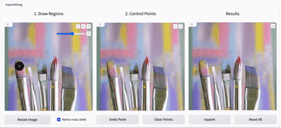

# Inpaint4Drag: Repurposing Inpainting Models for Drag-Based Image Editing via Bidirectional Warping (ICCV 2025)
 **Jingyi Lu, [Kai Han](https://www.kaihan.org/)**<br>
[Visual AI Lab, The University of Hong Kong](https://visailab.github.io/index.html)

[](https://colab.research.google.com/drive/1fzoyNzcJNZjM1_08FE9V2V20EQxGf4PH?usp=sharing)
 <a href="https://visual-ai.github.io/inpaint4drag"></a>
 <a href="https://arxiv.org/abs/2407.18247"></a>
  <a href="https://drive.google.com/file/d/1rdi4Rqka8zqHTbPyhQYtFC2UdWvAeAGV/view?usp=drive_link"></a>

<p align="left">
  
</p>

**TLDR**: Inpaint4Drag decomposes drag-based image editing into **bidirectional warping (0.01s)** and **image inpainting (0.3s)** (measured at 512×512). The method warps selected regions using bidirectional mapping, then fills revealed areas with inpainting models. Key advantages:

- **Physics-inspired**: Treats image regions as elastic materials for intuitive deformation
- **Real-time interaction**: Instant warping preview unlike existing methods requiring minutes per edit
- **Universal adapter**: Works with any inpainting model without modifications, inheriting future improvements
## Installation
After cloning this repository, you can install the dependencies through the following steps:
```bash
# Create and activate environment
conda create -n inpaint4drag python=3.10 -y
conda activate inpaint4drag

# Install requirements 
pip install -r requirements.txt

# Install EfficientViT-SAM (Optional)
pip install git+https://github.com/mit-han-lab/efficientvit.git
```

## Run Inpaint4Drag
After installing the requirements, you can simply launch the user inferface through:
```
python3 app.py
```

## Evaluation
You can evaluate our method by (1) downloading the [DragBench dataset](https://drive.google.com/file/d/1rdi4Rqka8zqHTbPyhQYtFC2UdWvAeAGV/view?usp=drive_link), (2) running [evaluation.py](evaluation.py) on DragBench-DR and DragBench-SR. You may use [utils/evaluator.py](utils/evaluator.py) to evaluate other drag editing methods.

### Step 1: Dataset Setup
```bash
# Install gdown and download drag_data.zip from Google Drive
pip install gdown
gdown 1rdi4Rqka8zqHTbPyhQYtFC2UdWvAeAGV

# Extract and clean up
unzip -q drag_data.zip
rm -rf drag_data.zip
```

### Step 2: Run Evaluation
Evaluate on DragBench-DR and DragBench-SR:
```bash
python evaluation.py --data_dir drag_data/dragbench-dr --output_dir output/dragbench-dr
```
```bash
python evaluation.py --data_dir drag_data/dragbench-sr --output_dir output/dragbench-sr
```


## BibTeX
Found this repo useful? We'd be grateful if you could give it a star ⭐ or cite our paper!
```
@inproceedings{lu2025inpaint4drag,
 author    = {Jingyi Lu and Kai Han},
 title     = {Inpaint4Drag: Repurposing Inpainting Models for Drag-Based Image Editing via Bidirectional Warping},
 booktitle = {International Conference on Computer Vision (ICCV)},
 year      = {2025},
}
```

## Related links
* [Drag Your GAN: Interactive Point-based Manipulation on the Generative Image Manifold](https://vcai.mpi-inf.mpg.de/projects/DragGAN/)
* [DragDiffusion: Harnessing Diffusion Models for Interactive Point-based Image Editing](https://github.com/Yujun-Shi/DragDiffusion/)
* [The Blessing of Randomness: SDE Beats ODE in General Diffusion-based Image Editing](https://github.com/ML-GSAI/SDE-Drag)
* [InstantDrag: Improving Interactivity in Drag-based Image Editing](https://github.com/SNU-VGILab/InstantDrag)
* [FastDrag: Manipulate Anything in One Step](https://github.com/XuanjiaZ/FastDrag)

